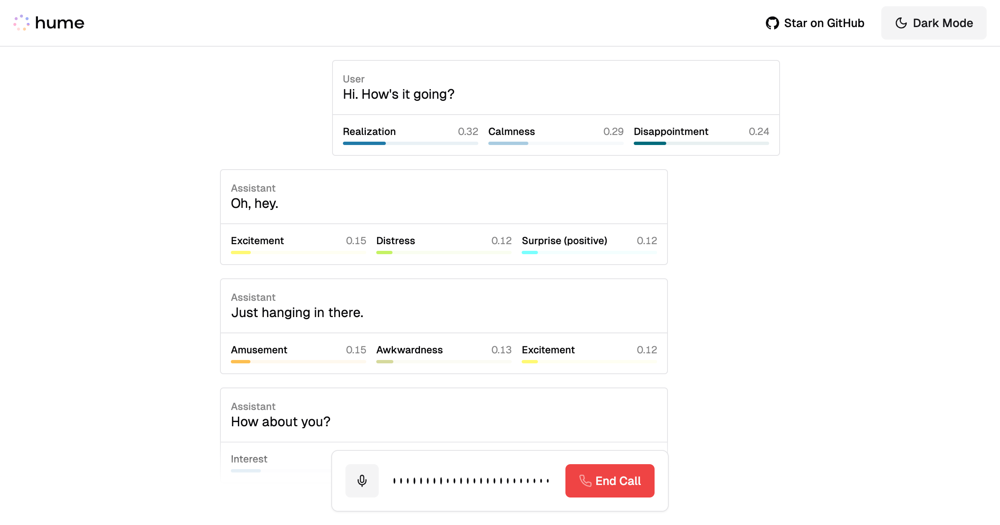

  
  <h1>Emotion-Aware Product Review System (with Hume EVI + LLaMA 3)</h1>

## 🚀 Overview

This project is a full-stack, real-time feedback system that leverages cutting-edge AI to extract **emotional insights from user reviews**. It was initiated during Cal Hacks and serves as a next-generation interface for analyzing how users *feel* about a product—not just what they say.

At its core, it integrates:

- **[Hume's Empathic Voice Interface (EVI)](https://hume.docs.buildwithfern.com/docs/empathic-voice-interface-evi/overview)** for multi-modal emotional sentiment extraction
- A responsive chat interface built with **Next.js (App Router)** and **React SDK**
- Real-time data flow with **Apache Kafka** and WebSockets
- Domain-optimized **LLaMA 3.1–8B** fine-tuned via **LoRA** for deeper, context-specific interpretation of user feedback

## ✨ Key Features

- 🎙️ Emotion-enriched product reviews via **Hume EVI**
- ⚡ Real-time feedback pipeline using **Kafka** and **WebSocket**
- 🧠 Intelligent analysis powered by **fine-tuned LLaMA 3.1–8B** inference models
- 🔐 End-to-end security with **SSH-encrypted Kafka consumers**
- 📊 Seamless UI with <500ms response latency for a frictionless user experience
- 💬 Secure, scalable feedback channel ideal for product teams, beta testers, and live reviews

## 🔧 Technologies Used

- **Frontend**: Next.js 14 (App Router), React, Tailwind CSS
- **Backend**: Kafka, Node.js, LLaMA 3.1 (LoRA), SSH
- **AI/ML**: Hume EVI API (real-time emotional inference), OpenAI integration (optional)
- **Security**: Encrypted transport via SSH, OAuth (if configured)
- **Deployment**: Vercel (1-click deploy)

## 🌐 Project Deployment

Click the button below to deploy this example project with Vercel:

### Deployment Steps

1. Fork or clone this repository into your GitHub.
2. Click the deploy button above or set up a new project on [vercel.com](https://vercel.com).
3. Provide your `HUME_API_KEY` and `HUME_CLIENT_SECRET`. You can obtain them via the [Hume AI Developer Portal](https://beta.hume.ai/settings/keys).
4. Done! Your emotion-aware feedback system is live.

## 🙌 Acknowledgments

- **Hume AI** for their incredible EVI platform
- **Meta** for LLaMA 3 open weights
- **Cal Hacks** for the hackathon opportunity

---

> 🧠 *This project brings a human layer to product analytics. Not just what users think—but how they feel.*
